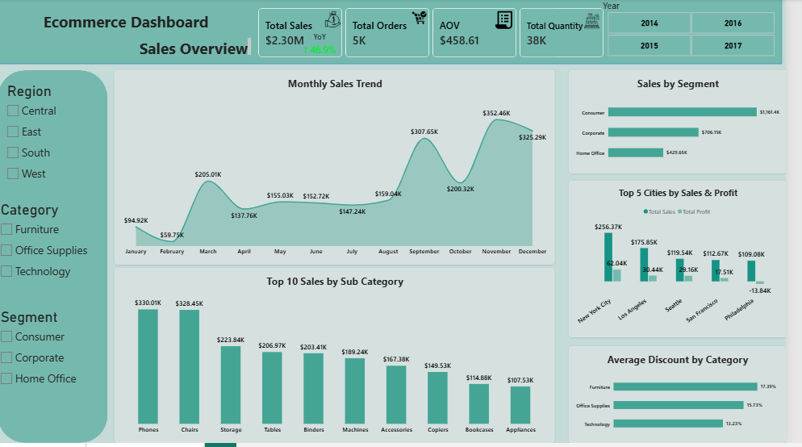
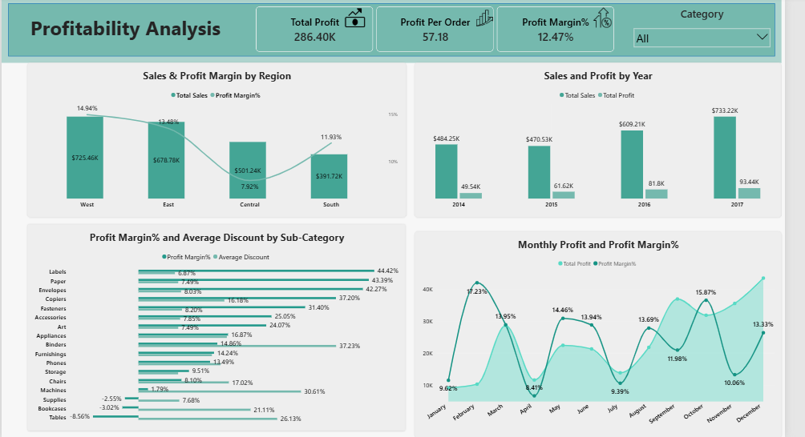

# E-Commerce Sales & Profitability Analysis | Power BI

## 📌 Project Overview

This project is a Power BI dashboard built to analyze an e-commerce business's sales and profitability performance.

The main goal was to understand **where sales are coming from, which areas are performing well, and where the business may have profitability problems**.

---

## 📸 Dashboard Preview

### Page 1 — Sales Overview

### Page 2 — Profitability Analysis

---

## 🎯 Business Context

The business had a large amount of sales data covering customers, products, categories, cities, regions, sales, profit, discounts, and dates.

Looking at sales alone was not enough to understand the overall business performance. I wanted to find out which areas were generating revenue and whether those sales were actually turning into profit.

---

## 🎯 Project Objective

My goal was to build an interactive Power BI dashboard that could help answer questions such as:

- Which customer segment generates the most sales?
- Which months and regions perform best?
- Which cities generate the most sales and profit?
- Which products are profitable or loss-making?
- Is there a relationship between discounts and profitability?
- Where should the business focus its attention?

---

## 🔨 My Approach

I used Power BI to:

- Prepare and explore the data
- Create KPIs for Sales, Profit, Orders, Quantity, and Average Order Value
- Analyze sales by customer segment
- Analyze monthly and yearly trends
- Compare sales and profit across cities and regions
- Analyze profit margins by product sub-category
- Compare discounts with profit margins
- Create an interactive two-page dashboard using DAX measures and Power BI visuals

---

## 📊 Key Results & Insights

The analysis produced several useful business insights:

- The **Consumer segment** generated the highest sales at approximately **$1.16M**.
- **West** was the strongest region, with approximately **$725K in sales and a 14.94% profit margin**.
- **New York City** generated the highest sales and profit among the top five cities, with approximately **$256K in sales and $62K profit**.
- **Philadelphia** generated approximately **$109K in sales but recorded a loss of $13.84K**, making it an area that needs further investigation.
- **Tables** generated approximately **$207K in sales but had a -8.56% profit margin**.
- Within Furniture, higher discounts were associated with weaker profit margins. Tables had a **26.13% average discount and -8.56% profit margin**.
- **Labels, Paper, and Envelopes** showed strong profit margins, with Labels reaching approximately **44.42%**.

---

## 💡 Business Impact

The dashboard shows that **high sales do not always mean high profitability**.

The analysis can help management:

- Identify strong-performing regions and cities
- Investigate loss-making markets such as Philadelphia
- Review products with negative profit margins
- Reconsider heavy discounting in low-margin products
- Understand which customer segments contribute most to revenue
- Focus on **profitable growth instead of sales growth alone**

The relationship between discount and profit margin is an area for further investigation. The dashboard shows an association, but it does not prove that discounts alone caused the losses.

---

## 📊 Dashboard Pages

### Page 1 — Sales Overview

Focuses on:

- Total Sales
- Total Orders
- Average Order Value
- Total Quantity
- Sales by Segment
- Monthly Sales Trend
- Top 5 Cities by Sales & Profit
- Sales by Sub-Category
- Average Discount by Category

### Page 2 — Profitability Analysis

Focuses on:

- Total Profit
- Profit Margin
- Profit per Order
- Sales & Profit Margin by Region
- Sales & Profit by Year
- Profit Margin by Sub-Category
- Discount vs Profit Margin
- Monthly Profit & Profit Margin

---

## 🛠️ Tools Used

- Power BI
- DAX

---

## 🎯 Key Takeaway

This project helped me understand that a good dashboard is not just about displaying numbers.

The goal is to turn data into a clear business story:

**Data → Analysis → Insight → Business Impact**

The biggest takeaway from this project was that **increasing sales alone is not enough. The business also needs to understand whether those sales are generating healthy profit.**
